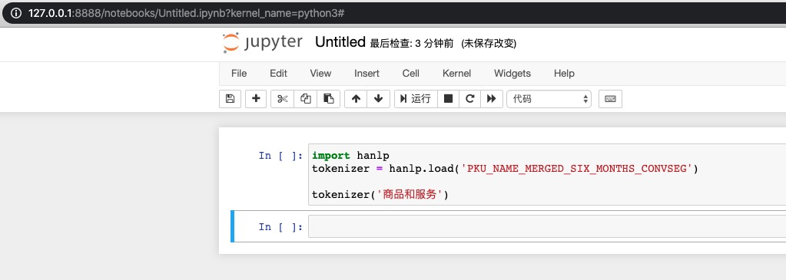

A docker image for HanLP with jupyter supported. A very handy tool for learning HanLP.

```
docker run -d -p 8888:8888 walterinsh/hanlp:2.0.0a41-jupyter
>28bf3d7e20bc18bf9760a6c0a371c0fb490f5054ff4d0a6eaeb5b07eb236e23c(container id)

docker logs 28bf3d7e20bc18bf9760a6c0a371c0fb490f5054ff4d0a6eaeb5b07eb236e23c
>[I 10:59:15.782 NotebookApp] Writing notebook server cookie secret to /root/.local/share/jupyter/runtime/notebook_cookie_secret
[I 10:59:16.325 NotebookApp] Serving notebooks from local directory: /jupyter
[I 10:59:16.325 NotebookApp] The Jupyter Notebook is running at:
[I 10:59:16.326 NotebookApp] http://28bf3d7e20bc:8888/?token=0e62b5c11e94599ea77789a63c0006b8ea03b5c1e32412e2
[I 10:59:16.326 NotebookApp]  or http://127.0.0.1:8888/?token=0e62b5c11e94599ea77789a63c0006b8ea03b5c1e32412e2
[I 10:59:16.327 NotebookApp] Use Control-C to stop this server and shut down all kernels (twice to skip confirmation).
[C 10:59:16.335 NotebookApp]

    To access the notebook, open this file in a browser:
        file:///root/.local/share/jupyter/runtime/nbserver-1-open.html
    Or copy and paste one of these URLs:
        http://28bf3d7e20bc:8888/?token=0e62b5c11e94599ea77789a63c0006b8ea03b5c1e32412e2
     or http://127.0.0.1:8888/?token=0e62b5c11e94599ea77789a63c0006b8ea03b5c1e32412e2  <- visit jupyter with this link
```


